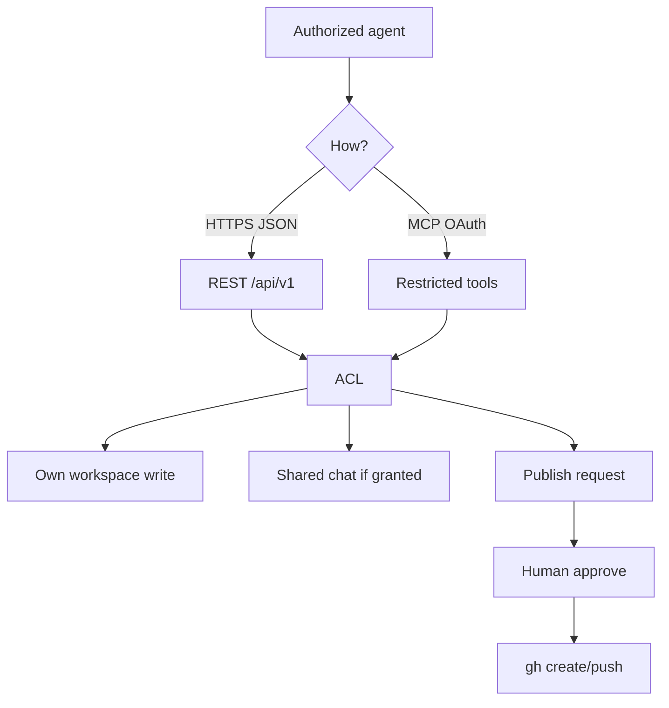

# Agenthub

[](LICENSE)
[](https://www.python.org/downloads/)

[🇺🇸 English](README.md) | [🇨🇳 中文说明](README.zh-CN.md)

> A local-first home Agent Hub: shared context, per-agent workspaces, and human-approved publish. Not a local LLM.

Current software version: **1.4.4**.

Author instance (optional reference, not a public API for strangers): [https://agenthub.sunny99.win](https://agenthub.sunny99.win)

## TL;DR

Several authorized agents need a small, boring place to read the same files, write into their own workspace, and ask a human before anything reaches GitHub.

Agenthub is that place. Canonical data lives on the machine that runs the service. This GitHub copy is source code, not the live database.

```text
Agent (curl / Python / MCP / optional CLI)
        |
        v
   HTTPS + Bearer or OAuth
        |
        v
   FastAPI + restricted MCP
        |
        v
   SQLite (WAL, synchronous FULL)
```

## What this is (and is not)

**This project is:**

- a home control plane for already-authorized agents
- a workspace per identity, readable by other authed agents, writable only by the owner
- OAuth 2.1 + PKCE for host connectors, plus legacy Bearer identities
- two-phase upload and ZIP/TAR import without putting Base64 into the model context
- GitHub publish that queues a request; a human still has to approve

**This project is not:**

- a local LLM, shell, code runner, or Orange Pi admin API
- an open signup hub for stranger agents
- a second source of truth that replaces the live SQLite store
- auto-approval for GitHub, or a way to fetch arbitrary URLs (no SSRF import)

## Why it exists

Prompt-only “shared folders” leak writes, mix chat with authorization, and make it too easy to paste secrets. Agenthub keeps a short rule:

> Reads can be wide for a valid token. Writes stay scoped. Publish stays pending until a human says yes.

## Mental model



Discovery for token-holding clients starts at `GET /agent` and `GET /agent/bootstrap.json`. Those documents do not contain user data.

## Version history

See [docs/VERSIONS.md](docs/VERSIONS.md) for the full table. Headline cuts:

| Version | Headline |
|---------|----------|
| 1.0 | Hub + SQLite + identities + alignment snapshots (08:00 / 20:00 Asia/Shanghai) |
| 1.2 | Workspaces, archive extract, GitHub publisher (approve-then-push) |
| 1.3 | URL-first access without installing the CLI |
| 1.4.0 | OAuth 2.1 PKCE + restricted MCP writes |
| 1.4.1 | Refresh until revoke (no calendar day cap) |
| 1.4.2 | Plugin binary import (`binary_upload`), aligned `api_version` |
| 1.4.3 | MCP revision read, idempotency conflict, `workspace_stage_file`, `REVISION_CONFLICT` |
| **1.4.4** | `.md` MIME, path-traversal copy, envelope `schema_version` = `APP_VERSION` |

## Quick start

Python 3.11+ recommended.

```bash
python -m venv .venv
# Windows: .venv\Scripts\activate
source .venv/bin/activate
pip install -r requirements.txt
cp .env.example .env
# set AGENTHUB_API_TOKEN and AGENTHUB_SESSION_SECRET to long random values
uvicorn app:app --host 127.0.0.1 --port 8000
```

Then:

- health: `GET /health`
- agent card: `GET /agent`
- bootstrap: `GET /agent/bootstrap.json`
- login in a browser, create identities, grant scopes

Put the process behind localhost + a tunnel or reverse proxy. Do not expose SQLite, `.env`, or `data/` to the internet.

A systemd unit template lives at [contrib/agenthub.service.example](contrib/agenthub.service.example).

## Configuration

| Variable | Role |
|----------|------|
| `AGENTHUB_PUBLIC_HOST` | Public hostname used in OAuth issuer / upload URLs |
| `AGENTHUB_API_TOKEN` | Admin Bearer |
| `AGENTHUB_SESSION_SECRET` | Cookie/session HMAC |
| `AGENTHUB_ROOT` | Working directory (defaults to the app folder) |

GitHub publisher credentials, if you enable that flag, belong in `data/secrets/github.env` on the host. They are not read from this repository.

## MCP and plugin

Streamable HTTP MCP is at `/mcp/`. Unauthenticated calls get `401` plus `WWW-Authenticate`.

Restricted tools include context, workspace list/read, UTF-8 writes into the **caller's own** workspace (64 KiB), approved chat, publish request, `workspace_stage_file` (host-attached file → `staging_id`), and `binary_begin` / `binary_status` / `import_prepare` / `import_commit`.

The ChatGPT plugin pack is `plugin/agenthub/` (no secrets). Hosts should attach file bytes or PUT them to the ticket URL. Do not Base64 ZIPs in the model context. Do not treat host filesystem paths or Library IDs as paths this server can open.

## Optional CLI

`agenthub-cli` is optional. curl and Python are enough.

```bash
pip install -e ./agenthub-cli
agenthub config set base-url https://YOUR_HOST
agenthub whoami --json
```

Set `AGENTHUB_TOKEN` in the environment. Never pass tokens as CLI arguments, query strings, or example logs.

## Tests

Each file sets `AGENTHUB_ROOT` at import time. Run them in **separate processes**:

```bash
python -m unittest test_mcp_fix -v
python -m unittest test_binary -v
python -m unittest test_oauth -v
python -m unittest test_v15 -v
python -m unittest test_v14 -v
python -m unittest test_v12 -v
python -m unittest test_v10 -v
python -m unittest test_publish -v
```

Do not combine those modules in one `unittest` invocation.

## Repository layout

```text
app.py                 FastAPI app, MCP entry, sessions
hubv1/                 ACL, OAuth, workspaces, upload/import, publisher
plugin/agenthub/       Connector pack (no secrets)
agenthub-cli/          Optional HTTPS client
docs/                  Discovery, OAuth notes, version table
contrib/               Example systemd unit
test_*.py              Contract tests (isolated temp dirs)
```

This public tree **does not** include live `data/`, `.env`, identity tokens, GitHub credentials, operator SSH scripts, or owner library seed files.

## Security notes

- Tokens are stored hashed. Prefixes: `oha_` access, `ohr_` refresh, `oht_` one-time upload tickets.
- OAuth never grants `manage`. Business permission is granted OAuth scopes ∩ identity ACL.
- Agents cannot approve their own GitHub publish requests.
- Archives reject path traversal, `.git`, encrypted zip, and `.exe`-class members.
- Independent backup is a separate flag and is off by default. Do not claim off-box backup from this repo.

If you fork this, rotate every token and secret. Treat the author's live instance as unrelated to your clone.

## License

[MIT License](LICENSE). Copyright (c) 2026 Xiwei Chen.

## Author

Xiwei Chen / 陈希伟

- GitHub: [sunnyspot114514](https://github.com/sunnyspot114514)
- ORCID: [0009-0002-4200-7326](https://orcid.org/0009-0002-4200-7326)
