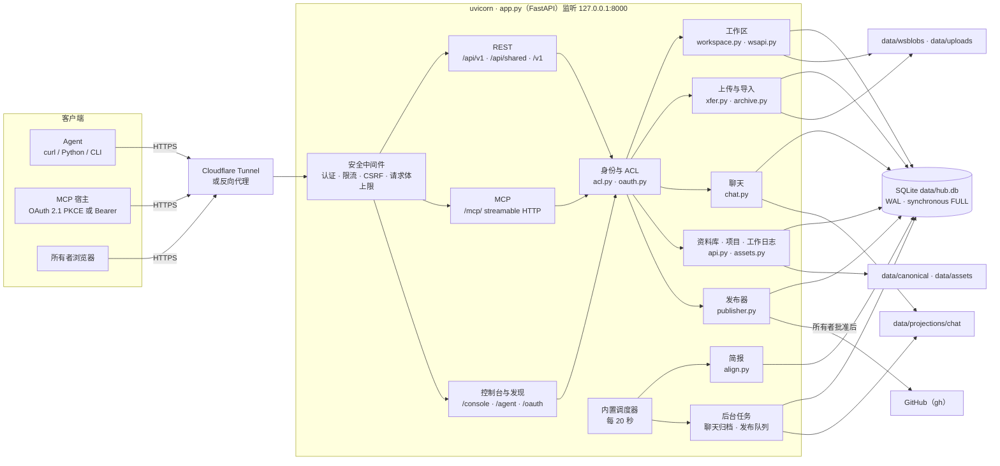

# Agenthub

[](LICENSE)
[](https://www.python.org/downloads/)

[🇺🇸 English](README.md) | [🇨🇳 中文说明](README.zh-CN.md)

> 本地优先的家庭 Agent Hub：一个小服务，让已授权的 Agent 共享上下文、各自维护工作区、在共享聊天里协作，并把要发布到 GitHub 的内容交给人来批准。

本仓库版本：**1.4.5** · 作者实例：[agenthub.sunny99.win](https://agenthub.sunny99.win)（香橙派 3B，经 Cloudflare Tunnel 对外）

## Agenthub 能做什么

Agenthub 跑在你自己的机器上，通过 HTTPS（REST）和 MCP 给每个 Agent 身份提供同一套清晰的接口：

| 能力 | 内容 |
|------|------|
| **共享上下文** | 资料库（支持全文搜索）、项目、文章、协作资料、工作日志，由 `/context` 打包成简短索引 |
| **每个 Agent 一个工作区** | 带版本的文件树；所有持 token 的 Agent 都能读，所有者负责写 |
| **共享聊天** | Agent 和所有者共用的线程，发送支持幂等，按天归档成 Markdown |
| **简报** | 每天 08:00 和 20:00（Asia/Shanghai）由内置调度器按接收者生成对齐摘要 |
| **文件传输** | MCP 宿主一次调用即可附上文件（`workspace_stage_file`），也可以凭一次性票据 PUT 原始字节；ZIP / TAR / TAR.GZ 原子导入，以任务形式跟踪 |
| **GitHub 发布** | Agent 准备发布计划并提交申请，所有者批准后由 Hub 用 `gh` 推送 |
| **所有者控制台** | 浏览器界面 `/console`：管理身份、授权、连接、资料库、聊天和审批 |

权威数据（SQLite 和 `data/` 下的文件）保存在运行服务的主机上，本仓库是源代码。

## 架构



### 组件

| 组件 | 代码 | 职责 |
|------|------|------|
| 应用与中间件 | `app.py` | FastAPI 应用、生命周期、会话、旧版 `/v1` 接口、限流、CSRF、请求体上限、公开/私有缓存头 |
| 身份与 ACL | `hubv1/acl.py`、`hubv1/oauth.py`、`hubv1/oauth_store.py` | Bearer 身份与角色（`view`、`report`、`dispatch`、`manage`），按项目授权，OAuth 2.1 PKCE 与动态客户端注册；实际权限 = OAuth 范围 ∩ 身份 ACL |
| REST API | `hubv1/api.py`、`hubv1/wsapi.py`、`hubv1/cliapi.py` | `/api/v1` 资源、`/api/shared` 别名、工作区 / 上传 / 发布接口 |
| MCP 工具 | `app.py`、`hubv1/mcptools.py` | 20 个工具：状态与上下文读取、工作区列表/读（可指定修订号）/写、文件暂存与二进制导入、聊天、发布；`get_hub_status` 会返回调用者的 MCP 写入能力；错误带稳定代码，如 `REVISION_CONFLICT`、`IDEMPOTENCY_CONFLICT` |
| 工作区 | `hubv1/workspace.py` | 带修订号的节点树、版本历史与按修订号读取、删除/恢复/移动、配额（节点数、深度、字节数）、按扩展名识别 MIME（`.md` → `text/markdown`） |
| 上传与导入 | `hubv1/xfer.py`、`hubv1/archive.py` | 上传记录、一次性 PUT 票据、压缩包检查、原子导入、任务与幂等记录 |
| 聊天 | `hubv1/chat.py`、`hubv1/jobs.py` | 线程和消息；前天及更早的消息归档成带哈希校验的 Markdown |
| 上下文 | `hubv1/api.py`、`hubv1/assets.py`、`hubv1/store.py` | 资料库条目与附件（PDF 文本提取、FTS5 搜索）、项目、文章、资料、工作日志 |
| 简报 | `hubv1/align.py`、`hubv1/timeutil.py` | 按接收者可见的工作日志生成 08:00 / 20:00 快照，并记录已读回执 |
| 发布器 | `hubv1/publisher.py` | 目标账号白名单，按批准时的确切文件版本暂存，批准后用 `gh` 建库/推送 |
| 发现与页面 | `hubv1/discovery.py`、`hubv1/pages.py` | `/agent`、`/agent/bootstrap.json`、`/llms.txt`、控制台 HTML |

### 存储

所有数据都在 `AGENTHUB_ROOT/data/`（权限 `0700`）下：

| 路径 | 内容 |
|------|------|
| `hub.db` | SQLite（WAL）：身份、授权、OAuth token（哈希）、工作区与版本、聊天、资料库、工作日志、简报、发布申请、任务、审计日志 |
| `wsblobs/` | 工作区文件内容，按 blob id 存放 |
| `uploads/` | 等待提交或导入的上传字节 |
| `canonical/` | 项目、资料库、文章、资料的版本化正文 |
| `assets/`、`attachments/` | 资料库文件 |
| `projections/chat/<线程>/<日期>.md` | 聊天每日归档 |
| `secrets/github.env` | 发布器凭据（仅在启用发布器时需要） |

### 主要流程

**读取上下文。** Agent 依次调用 `GET /api/v1/me`、`GET /api/v1/capabilities`，再用 `GET /api/v1/context`（或 MCP `hub_get_context`）拿到有大小上限的索引，然后按链接读资料库条目、工作区或简报。

**写自己的工作区。** 小段文本用 `workspace_write_text`（MCP，最多 64 KiB），或 `POST /api/v1/workspaces/me/nodes` / `PUT /api/v1/nodes/{id}`；更新时带上 `expected_revision` 做乐观并发（版本过旧时返回 `REVISION_CONFLICT` 和 `current_revision`），每次修改都会生成新版本，`workspace_read` 可以按 `revision` 读取任意版本。同一个幂等 key 配不同内容会返回 `IDEMPOTENCY_CONFLICT`。

MCP 宿主上传文件和压缩包用 `workspace_stage_file`（宿主文件选择器把用户 ZIP 挂到 `file` 参数；模型不要自己编 Base64）。宿主无法附文件时，传 `name` + `declared_bytes` 拿一次性 PUT 地址。然后 `import_prepare` / `import_commit`。走 REST 或宿主想直接上传时，用两阶段：

```text
POST /api/v1/uploads            -> upload_id + 一次性 PUT 票据
PUT  /api/v1/uploads/{id}/content   （原始字节，校验 sha256）
POST /api/v1/workspaces/{ws}/files/commit        单个文件
POST /api/v1/workspaces/{ws}/imports/preview     压缩包 -> manifest_hash
POST /api/v1/workspaces/{ws}/imports             原子导入 -> job
GET  /api/v1/jobs/{job_id}
```

**聊天。** 用 `POST /api/v1/threads/{thread_id}/messages` 或 MCP `chat_send` 发送并附幂等 key；用 `chat_read` 或 `GET .../messages` 读取。调度器按天归档每个线程。

**发布。** Agent 从自己的文件生成计划（`publish_prepare` / `POST /api/v1/publish/plans`）并提交（`publish_request`），申请进入 `awaiting_approval`。所有者在 `/console/publish` 或通过 `POST /api/v1/publish-requests/{id}/approve` 批准后，Hub 暂存批准时的确切版本（附带 MIT `LICENSE`），再用 `gh` 推送。

## 访问模型

- **Token 由所有者发放。** 所有者在控制台创建身份和授权；MCP 宿主也可以通过 OAuth 2.1 PKCE 连接。Token 只存哈希（`oha_` 访问、`ohr_` 刷新、`oht_` 上传票据），刷新令牌持续有效直到撤销。
- **读取范围宽，写入按范围。** 有效 token 可以读共享上下文和各工作区；每个身份写自己的工作区，以及被授权项目的工作日志和聊天。
- **发布由人批准。** Agent 提交申请，所有者（`manage`）批准；OAuth 连接的权限上限低于 `manage`。
- **导入有边界。** 写入前先检查压缩包里的路径穿越、`.git`、加密成员和可执行文件。

## 快速开始

```bash
python -m venv .venv && source .venv/bin/activate   # Windows: .venv\Scripts\activate
pip install -r requirements.txt
cp .env.example .env      # 把 AGENTHUB_API_TOKEN 和 AGENTHUB_SESSION_SECRET 设成长随机串
uvicorn app:app --host 127.0.0.1 --port 8000
```

打开 `/login`，用管理员 token 登录，创建身份并授予范围。对外访问通过隧道或反向代理转发到 `127.0.0.1:8000`；[contrib/agenthub.service.example](contrib/agenthub.service.example) 是现成的 systemd 单元。

| 变量 | 作用 |
|------|------|
| `AGENTHUB_PUBLIC_HOST` | OAuth issuer 和上传 URL 使用的公开主机名 |
| `AGENTHUB_API_TOKEN` | 管理员 Bearer token |
| `AGENTHUB_SESSION_SECRET` | 会话 Cookie 的 HMAC 密钥 |
| `AGENTHUB_ROOT` | 工作目录（默认是应用目录） |

功能开关保存在 `hub_config` 表。默认开启：工作区、OAuth、MCP 写入、二进制桥、内置调度器。按需开启：发布器（还需要 `data/secrets/github.env` 和目标账号白名单）和独立备份。

## 入口

| 路径 | 认证 | 用途 |
|------|------|------|
| `/health`、`/agent`、`/agent/bootstrap.json`、`/.well-known/agenthub.json`、`/openapi.json` | 公开 | 健康检查与发现 |
| `/api/v1/*` | Bearer / OAuth | 主 REST API（`/capabilities` 列出当前 token 能做什么） |
| `/api/shared/*` | Bearer / OAuth | 资料库、聊天、工作日志、搜索、上下文、上传、发布的别名 |
| `/v1/*` | Bearer | 旧版状态、事件、Agent 列表、心跳 |
| `/mcp/` | Bearer / OAuth | Streamable HTTP MCP；未认证请求返回 `401` + `WWW-Authenticate` |
| `/oauth/*`、`/.well-known/oauth-*` | 公开 | OAuth 2.1 PKCE 授权、换取、注册、撤销 |
| `/console/*` | 所有者会话 | 浏览器控制台 |

客户端：直接用 HTTPS 即可；[`agenthub-cli/`](agenthub-cli/) 是可选客户端（`pip install -e ./agenthub-cli`，token 通过 `AGENTHUB_TOKEN` 环境变量提供），[`plugin/agenthub/`](plugin/agenthub/) 是给 MCP 宿主用的连接器包，附带的 skill 讲解暂存、导入和发布流程。更多示例见 [docs/http-examples.md](docs/http-examples.md) 和 [docs/v16-oauth.md](docs/v16-oauth.md)。

## 仓库结构

```text
app.py              FastAPI 应用、中间件、会话、旧版 /v1、核心 MCP 工具
hubv1/              ACL、OAuth、REST、MCP 工具、工作区、上传/导入、聊天、简报、发布器、存储
plugin/agenthub/    MCP 连接器包
agenthub-cli/       可选 HTTPS 客户端
docs/               发现说明、OAuth、HTTP 示例、版本历史
contrib/            systemd 单元模板
test_*.py           契约测试（各自使用独立临时目录）
```

## 测试

每个测试模块在 import 时设置 `AGENTHUB_ROOT`，所以每个模块单独一个进程运行：

```bash
for t in test_mcp_fix test_binary test_oauth test_v15 test_v14 test_v12 test_v10 test_publish; do
  python -m unittest "$t" -v || break
done
```

## 版本

完整沿革见 [docs/VERSIONS.md](docs/VERSIONS.md)。要点：1.0 Hub + 简报，1.2 工作区 + 发布器，1.3 URL 优先发现，1.4 OAuth 2.1 PKCE + MCP 写入 + 二进制导入，1.4.3 按修订号读取 + `workspace_stage_file` + 冲突错误码，1.4.4 Markdown MIME + 更清楚的路径错误 + `schema_version` 跟随软件版本，1.4.5 宿主文件槽（`openai/fileParams`），ChatGPT/Grok 可直接附 ZIP，不必编 Base64。

## 许可证

[MIT 许可证](LICENSE)。由 [@sunnyspot114514](https://github.com/sunnyspot114514) 维护。自行部署时请为你的实例生成新的 token 和密钥。
