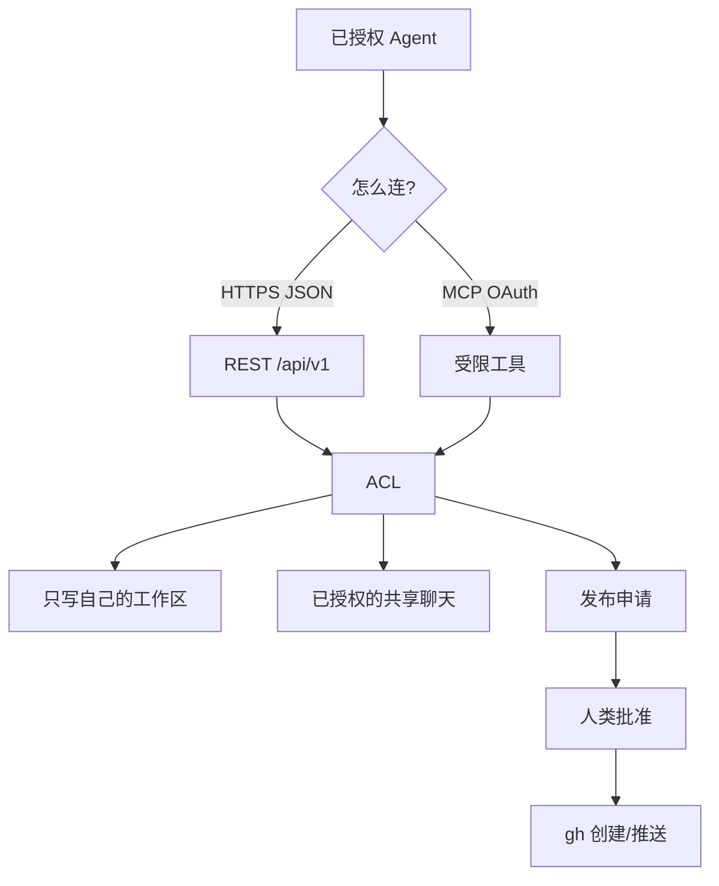

# Agenthub

[](LICENSE)
[](https://www.python.org/downloads/)

[🇺🇸 English](README.md) | [🇨🇳 中文说明](README.zh-CN.md)

> 本地优先的家庭 Agent Hub：共享上下文、每身份工作区、人工批准后才发布。不是本地大模型。

当前软件版本：**1.4.2**。

作者实例（仅作参考，不是对陌生人开放的公共 API）：[https://agenthub.sunny99.win](https://agenthub.sunny99.win)

## 概要

若干已经拿到授权的 Agent 需要一个小而清楚的地方：读同一批资料、只写自己的工作区、在任何内容上 GitHub 之前先经过人。

Agenthub 就是这个地方。权威数据在跑服务的那台机器上。本仓库是源代码，不是线上数据库。

```text
Agent（curl / Python / MCP / 可选 CLI）
        |
        v
   HTTPS + Bearer 或 OAuth
        |
        v
   FastAPI + 受限 MCP
        |
        v
   SQLite（WAL，synchronous FULL）
```

## 本项目是什么（以及不是什么）

**本项目是：**

- 给已授权 Agent 用的家庭控制面
- 每个身份一个工作区：其他持 token 的 Agent 可读，只有所有者可写
- OAuth 2.1 + PKCE 宿主连接，以及传统 Bearer 身份
- 两阶段上传和 ZIP/TAR 导入，不把 Base64 塞进模型上下文
- GitHub 发布只进申请队列，必须人类批准后才推送

**本项目不是：**

- 本地 LLM、shell、代码运行器，或开发板管理 API
- 给陌生 Agent 开放注册的站点
- 可以替代线上 SQLite 的第二真源
- 自动批准 GitHub，或任意 URL 拉取导入（禁止 SSRF）

## 为什么做

只靠提示词的「共享文件夹」容易把写入权限漏出去，把聊天当成授权，也容易把密钥粘进对话。Agenthub 只守一条短规则：

> 有效 token 的读可以较宽。写必须按范围。发布在人类点头之前一直待审。

## 心智模型



持 token 的客户端从 `GET /agent` 和 `GET /agent/bootstrap.json` 开始发现接口。这两份文档不含用户数据。

## 版本沿革

完整表见 [docs/VERSIONS.md](docs/VERSIONS.md)。提要：

| 版本 | 要点 |
|------|------|
| 1.0 | Hub + SQLite + 身份 + 08:00 / 20:00（Asia/Shanghai）对齐摘要 |
| 1.2 | 工作区、压缩包解压、GitHub 发布（先申请后批准） |
| 1.3 | URL 优先，不必安装 CLI |
| 1.4.0 | OAuth 2.1 PKCE + 受限 MCP 写入 |
| 1.4.1 | 刷新令牌直到撤销（无按天日历上限） |
| **1.4.2** | 插件大文件导入（`binary_upload`），`api_version` 与 Hub 状态对齐 |

## 快速开始

建议 Python 3.11+。

```bash
python -m venv .venv
# Windows: .venv\Scripts\activate
source .venv/bin/activate
pip install -r requirements.txt
cp .env.example .env
# 把 AGENTHUB_API_TOKEN 和 AGENTHUB_SESSION_SECRET 设成长随机串
uvicorn app:app --host 127.0.0.1 --port 8000
```

然后：

- 健康检查：`GET /health`
- Agent 说明：`GET /agent`
- 引导：`GET /agent/bootstrap.json`
- 浏览器登录，创建身份，授予范围

进程应放在本机回环 + 隧道或反代后面。不要把 SQLite、`.env` 或 `data/` 直接暴露到公网。

systemd 示例：[contrib/agenthub.service.example](contrib/agenthub.service.example)。

## 配置

| 变量 | 作用 |
|------|------|
| `AGENTHUB_PUBLIC_HOST` | OAuth issuer / 上传 URL 用的公开主机名 |
| `AGENTHUB_API_TOKEN` | 管理员 Bearer |
| `AGENTHUB_SESSION_SECRET` | Cookie/session HMAC |
| `AGENTHUB_ROOT` | 工作目录（默认为应用目录） |

若打开 publisher，GitHub 凭据放在主机上的 `data/secrets/github.env`，不进本仓库。

## MCP 与插件

Streamable HTTP MCP 在 `/mcp/`。未认证请求返回 `401` 和 `WWW-Authenticate`。

受限工具包括上下文、工作区列表/读取、向**调用者自己的**工作区写 UTF-8 文本（64 KiB）、已授权聊天、发布申请，以及 1.4.2 起的 `binary_begin` / `binary_status` / `import_prepare` / `import_commit`。

ChatGPT 插件包在 `plugin/agenthub/`（不含密钥）。宿主应把原始字节 PUT 到一次性上传地址。不要把 ZIP 编成 Base64。不要把宿主本地路径或 Library ID 当成这台服务器能打开的路径。

## 可选 CLI

`agenthub-cli` 不是必需的。curl 和 Python 即可。

```bash
pip install -e ./agenthub-cli
agenthub config set base-url https://YOUR_HOST
agenthub whoami --json
```

把 `AGENTHUB_TOKEN` 放在环境变量里。不要把 token 写进命令行参数、查询字符串或示例日志。

## 测试

每个测试文件在 import 时设置 `AGENTHUB_ROOT`。必须**分进程**跑：

```bash
python -m unittest test_binary -v
python -m unittest test_oauth -v
python -m unittest test_v15 -v
python -m unittest test_v14 -v
python -m unittest test_v12 -v
python -m unittest test_v10 -v
python -m unittest test_publish -v
```

不要把这些模块合并进一次 `unittest` 调用。

## 仓库结构

```text
app.py                 FastAPI 应用、MCP 入口、会话
hubv1/                 ACL、OAuth、工作区、上传/导入、发布器
plugin/agenthub/       连接器包（无密钥）
agenthub-cli/          可选 HTTPS 客户端
docs/                  发现文档、OAuth 说明、版本表
contrib/               systemd 示例
test_*.py              契约测试（独立临时目录）
```

这份公开树**不含**线上 `data/`、`.env`、身份 token、GitHub 凭据、运维 SSH 脚本，以及所有者资料库种子文件。

## 安全说明

- Token 只存哈希。前缀：`oha_` 访问、`ohr_` 刷新、`oht_` 一次性上传票。
- OAuth 从不授予 `manage`。业务权限是 OAuth 范围 ∩ 身份 ACL。
- Agent 不能批准自己的 GitHub 发布申请。
- 压缩包拒绝路径穿越、`.git`、加密 zip，以及 `.exe` 一类成员。
- 独立备份是单独开关，默认关闭。不要根据本仓库声称已经做了异地备份。

若你 fork，请轮换全部 token 和密钥。作者的线上实例与你的克隆无关。

## 许可证

[MIT 许可证](LICENSE)。Copyright (c) 2026 Xiwei Chen。

## 作者

陈希伟 / Xiwei Chen

- GitHub：[sunnyspot114514](https://github.com/sunnyspot114514)
- ORCID：[0009-0002-4200-7326](https://orcid.org/0009-0002-4200-7326)
